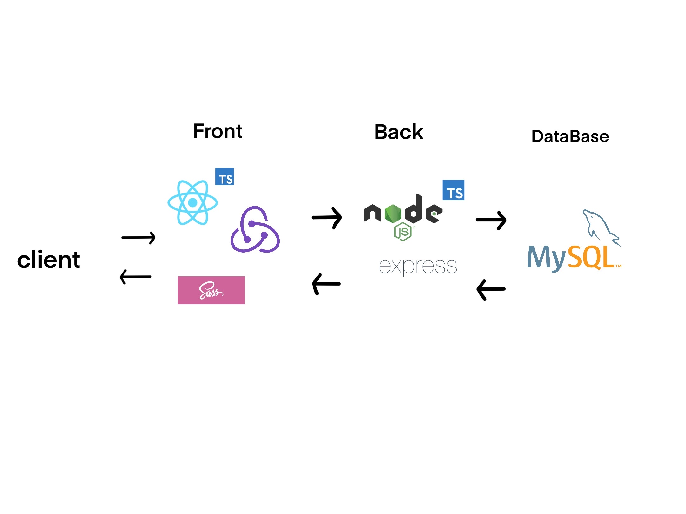
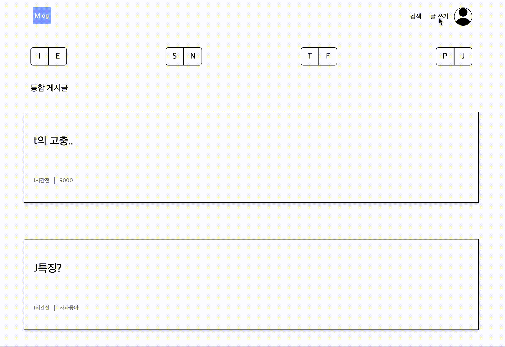

# 소개

-   mbti별로 분류한 포스트를 작성하고 볼 수 있는 블로그입니다.

# 적용 기술

## Front

   

## Back

  

## Database

## Hosting

# 주요 기능

-   로그인, 로그아웃, 회원가입.
-   게시글 생성, 수정, 삭제.
-   mbti 카테고리 별 게시글 초기화.
-   자신의 mbti 카테고리에만 글을 작성할 수 있습니다.

# 프로젝트 구조

# 파일 구조

-   mlog
    -   src
        -   view (컴포넌트)
        -   controller (기능)
        -   store (redux toolkit)
        -   App.tsx
        -   index.tsx
        -   types.d.ts
    -   server
        -   app.ts

# 로그인 화면

# 메인 화면

# 게시글 화면

# 프로젝트 후기

-   <code>redux toolkit</code>사용 경험으로 상태관리의 편리성을 이해
-   <code>MySQL</code> 사용 경험으로 데이터베이스와 서버 소통을 이해
-   백엔드와, DB 구축 경험으로 <code>REST API</code>의 필요성을 이해
